# I-Mortal project brief and architecture

**Source review: 2026-10-01. Status: security foundation under development; production operations disabled.**

I-Mortal is developing the security infrastructure for a trading application. The current repository centers on **TrustBroker**, a .NET 10 executable and supporting library code for hardware-aware security, confidential-compute authorization, workload integrity, device identity, security monitoring, and protected records. It also preserves storage, replay, rollback, and crash-recovery designs and conformance tests.

There is substantial implemented validation and orchestration, but no trading interface, exchange order execution, portfolio engine, or end-to-end trading workflow in this snapshot. Hardware detection, a successful comparison, and a passing unit test each establish a narrower fact than operational authorization.

This brief covers the common infrastructure and ordinary-user path. Diagrams are scoped views of those areas. Source and design references identify what exists today; future dependencies are explicitly marked. Existing repository history and source files are separate from this documentation update.

## Contents

1. [Project inventory and implementation status](#project-inventory-and-implementation-status)
2. [System architecture](#system-architecture)
3. [Executable startup and operation boundary](#executable-startup-and-operation-boundary)
4. [Request-bound authorization](#request-bound-authorization)
5. [Confidential-compute attestation](#confidential-compute-attestation)
6. [Workload and source integrity](#workload-and-source-integrity)
7. [Platform providers and mobile evidence](#platform-providers-and-mobile-evidence)
8. [User enrollment and device identity](#user-enrollment-and-device-identity)
9. [Account and encrypted-storage design](#account-and-encrypted-storage-design)
10. [Replay, rollback, and crash recovery](#replay-rollback-and-crash-recovery)
11. [Protected-state contracts](#protected-state-contracts)
12. [Security sensors and asset observations](#security-sensors-and-asset-observations)
13. [Protected records and diagnostics](#protected-records-and-diagnostics)
14. [Build, tests, and publication](#build-tests-and-publication)
15. [Remaining work and review findings](#remaining-work-and-review-findings)

## Project inventory and implementation status

The current application tree contains **258 C# files: 239 runtime files and 19 conformance files**, plus two project definitions. Runtime source totals **15,621 lines**, including comments and blank lines. Generated files, backups, build output, and independent experiments are excluded from these counts. The public export also contains **57 sanitized design templates**. These are whole-tree inventory counts, not a count of completed features.

| Area | Current implementation | Boundary still to complete |
| --- | --- | --- |
| Executable startup | Contract integrity/semantics checks and fixed production denial | Deployment composition and separately authorized operational startup |
| Request validation | Required-field and expiry checks; dispatch denial | Authenticated operation scope, durable replay, actual dispatch |
| Authorization root | Shared issuance, request ownership, time capture, gate sequencing, commit-before-approval | Independently provisioned approving lifecycle and evidence services |
| TEE root | TDX/SNP policy checks, snapshotting, verifier interfaces | Quote/report verification, collateral, trusted measurements, deployment |
| Workload integrity | Exact policy/evidence comparisons and challenge transcript binding | Authenticated inventory, policy provenance, approving context producer |
| Platform adapters | Detection implementations or platform placeholders | Real enrollment, signing, attestation, authorization, revocation |
| User enrollment | Random registration nonce, derived identifiers, conservative profile | Durable account/device enrollment and authenticated profile acquisition |
| Device proof | Canonical serializers, fingerprint hashing, algorithm allowlist | Hardware signing, signature verifier, single-use challenge service |
| Account authentication | Versioned parameter and schema contracts | Password implementation, sessions, rate limits, delivery, database integration |
| Encrypted storage | SQLCipher and hardware key-wrap design contracts | Native provider integration, key provisioning, migration/restore validation |
| Replay and rollback | Persistence, uniqueness, counter/commitment and ordering designs | Durable store, independently anchored state, crash-tested implementation |
| Protected state | Typed snapshots, transitions, commit/recovery interfaces | Atomic store, trusted durability proofs, transition/recovery engine |
| Sensors | Coordinator, source comparison, telemetry adapters, transfer correlation | Authenticated collectors, independent monitor, incident ledger, outbox |
| Protected records | Authorization-before-resolution and scoped receipt checks | Provisioned provider, trust anchors, key/service operations |
| Trading product | Trading/asset observation contracts | UI, market data, strategy/order/risk services, exchange integration |

The principal source is [security-infrastructure/src](../security-infrastructure/src). The smaller [I-Mortal.Security library](../src/I-Mortal.Security) preserves six independently testable algorithm-policy and challenge-serialization files copied from that source.

A fresh Roslyn semantic inventory examined all 239 runtime files with the Windows
compilation symbol and .NET 10 reference assemblies: **326 declared types, 890
explicit method/accessor/constructor/local-function/property-body declarations,
1,762 invocation/construction sites, zero errors, and zero warnings**. It found
**103 interfaces, 76 without a concrete implementation in that compilation**.
These counts exclude generated record members. Static implementation candidates
are not proof of dependency registration, external/native behavior, or hardware
trust. The portable public build separately compiled the Linux-selected path.

## System architecture

Solid arrows below describe source-level dependencies or implemented decisions. Dashed arrows describe interfaces whose production services are still required. These are logical boundaries, not a deployed network topology.

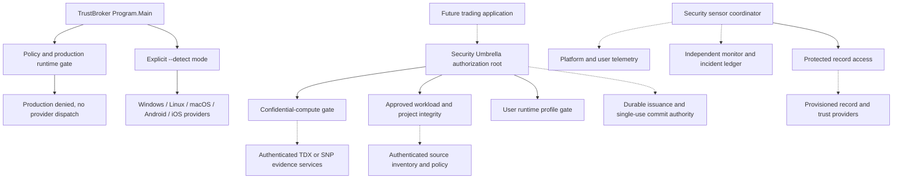

`Program.Main` does not instantiate or call the Umbrella root. The root, sensor coordinator, and protected-record resolver are available composition components, not a running service assembled by the executable. There is no HTTP API, background collector host, production dependency-registration module, or cloud deployment configuration in the reviewed snapshot.

## Executable startup and operation boundary

[Program.cs](../security-infrastructure/src/Program.cs) has a distinct detection path. Normal startup verifies policy bytes, required policy statements, the request contract, and the frozen production gate. The public snapshot intentionally contains invalid replacement trust-anchor values and removed deployment paths; it cannot serve as deployment configuration.

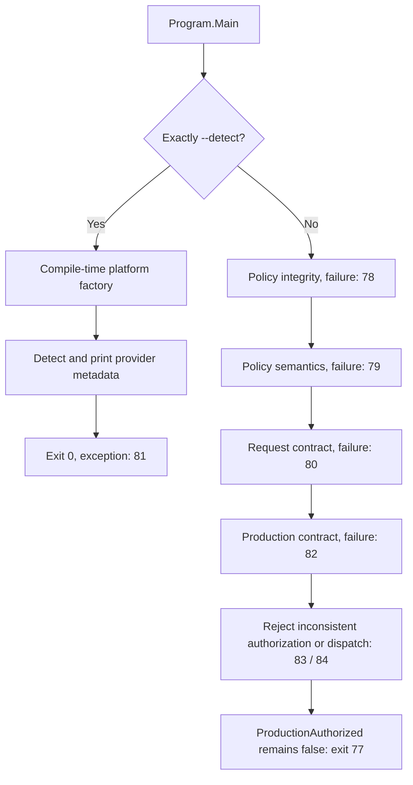

[ProductionRuntimeGate](../security-infrastructure/src/Security/ProductionRuntimeGate.cs) checks the expected SHA-256 and a closed set of contract semantics, rejecting malformed entries, duplicate keys, missing statements, and unknown statements. Even successful contract verification returns `ProductionAuthorized=false` and `ProviderDispatchAllowed=false`.

[ProductionStartupDecision](../security-infrastructure/src/Security/ProductionStartupDecision.cs) exposes test-observable startup effects but invokes none. [AuthorizationRequestValidator](../security-infrastructure/src/Providers/AuthorizationRequestValidator.cs) checks request ID, operation, device identity, nonce, policy version, authorization-state presence, and expiry. It does not authenticate those values or store replay state. [TrustOperationBoundary](../security-infrastructure/src/Providers/TrustOperationBoundary.cs) rejects valid requests with `PROVIDER_DISPATCH_DISABLED`.

Detection can access native platform APIs. It is separate from production authorization and is not a hardware-attestation result.

## Request-bound authorization

The current [Umbrella foundation](../security-infrastructure/src/Security/ConfidentialCompute/IMortalSecurityUmbrellaRoot.Foundation.cs) supersedes the older mode-only evaluation path. That legacy overload now always denies. The current overload takes an `AuthorizationIntent` and a separately supplied production-policy decision.

The ordinary-user path below is implemented orchestration; the diagram's approving responses depend on production services that are not supplied by the repository.

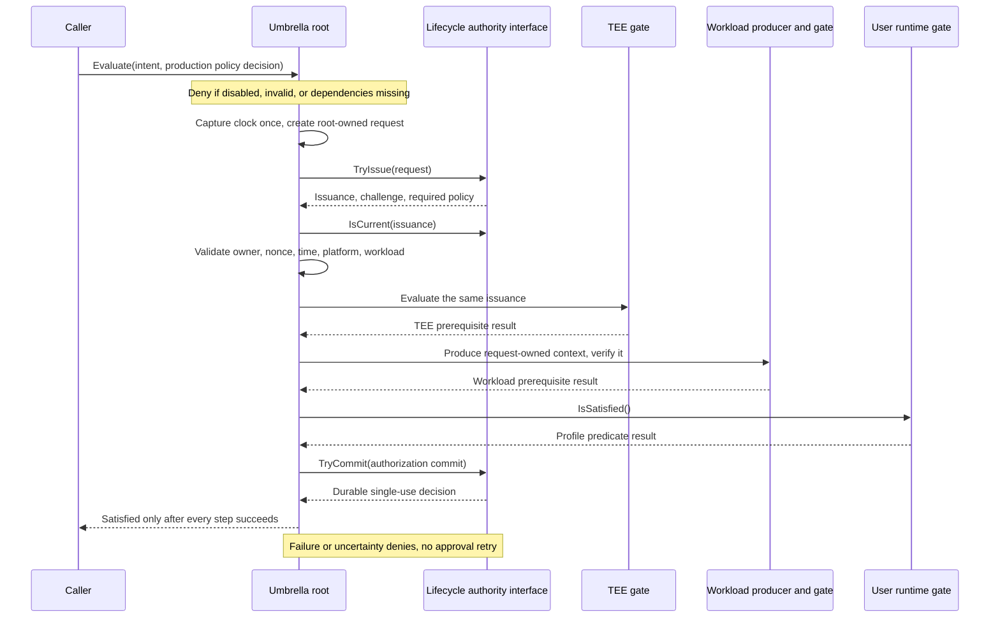

The root enforces a nonce of at least 32 bytes, valid issuance/expiry bounds, the expected TDX/SNP platform, and matching workload. Workload context ownership is checked by object identity; the exact issued challenge and policy objects must reach that context. Publicly constructing a similarly shaped context does not establish request ownership.

Reference identity is an in-process binding mechanism. It does not authenticate an external issuer or prove durable storage. [IAuthorizationLifecycle](../security-infrastructure/src/Security/ConfidentialCompute/AuthorizationTransaction.cs) must supply authenticated policy, trusted current state, unpredictable issuance, replay control, and atomic final revalidation. Its default implementation denies all requests. A returned root result is scoped to the evaluation and is not an executable trading capability.

## Confidential-compute attestation

[RootConfidentialComputeGate](../security-infrastructure/src/Security/ConfidentialCompute/RootConfidentialComputeGate.cs) recognizes Intel TDX and AMD SEV-SNP as its root confidential-compute classes. Client TPM or mobile hardware status does not substitute for this root requirement.

```mermaid
flowchart LR
    Issued["Exact issued authorization"] --> Acquire["Transaction evidence provider interface"]
    Acquire --> Snapshot["Copy asserted fields into immutable snapshot"]
    Snapshot --> Shape["Origin, platform, boundary, interval, required fields"]
    Shape --> Bind["Expected platform, workload, issuance time"]
    Bind --> Crypto["Transaction cryptographic verifier interface"]
    Crypto --> General["Attestation verifier interface"]
    General --> Policy["Independent measurement policy interface"]
    Policy --> Result["TEE prerequisite satisfied or denied"]
```

The transaction path reads evidence properties once and evaluates the snapshot. Exceptions become denial. The verifier contract requires signed quote/report validation, collateral, independent trust anchors, revocation/TCB policy, and report-data challenge binding. Concrete approving implementations are absent.

TDX/SNP raw-evidence and cryptographic-result types are present, but those data types do not supply a complete vendor verification service. `VerifiedEvidenceNormalizer` checks asserted fields; its name does not mean it verifies a cryptographic signature. The root invokes separate verifier dependencies for that responsibility.

The parameterless acquisition interface and older time-based TEE overload still exist. The current transaction path explicitly uses issuance-aware acquisition. A deployment must preserve that distinction.

## Workload and source integrity

[TransactionBoundApprovedWorkloadGate](../security-infrastructure/src/Security/ConfidentialCompute/TransactionBoundApprovedWorkloadGate.cs) delegates through [ApprovedWorkloadTrustedEvidenceBoundary](../security-infrastructure/src/Security/ConfidentialCompute/ApprovedWorkloadTrustedEvidenceBoundary.cs) to a strict AND composition.

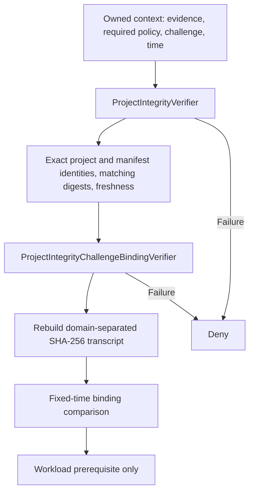

The transcript includes challenge ID, nonce, issue/expiry ticks, platform, workload identity, project/manifest identities, manifest/source/workload digests, and observation time. Fields use length prefixes and big-endian numeric encoding. The challenge verifier requires SHA-256-sized digests and evidence observed within the challenge interval, no later than evaluation time.

The standalone integrity verifier permits up to one minute of future clock skew and five minutes of evidence age. The composite path is stricter because its challenge verifier rejects future observations. The standalone challenge verifier accepts a nonce of at least 16 bytes; the root issuance path imposes the stronger 32-byte requirement.

These comparisons establish consistency with supplied inputs. Authenticating the policy and evidence remains an external responsibility. `DenyAllApprovedWorkloadContextProducer` is the default producer.

Protected inventory scope has a concrete boundary-owned scope authority/provider. Enumeration and canonicalization remain interfaces. Separately, [SourceIntegritySensor](../security-infrastructure/src/Security/Sensors/SourceIntegritySensor.cs) implements inventory comparison for reporting:

| Comparison or validation | Current behavior |
| --- | --- |
| Stable snapshots and scope | Detects unstable snapshots and changed scope |
| Path safety | Rejects absolute/traversal paths, backslashes, colon/control characters, non-NFC paths, reserved names, trailing dots/spaces |
| Ambiguity | Rejects links/reparse points, case aliases, duplicate file identities, malformed digests |
| Changes | Classifies additions, deletions, renames, and content/file-identity modifications |
| Collection gaps | Reports overflow, missed events, inaccessible files, and scan failures |
| Authorized changes | Adds a separately verified authorization finding; does not silently accept a new baseline |

Filesystem watchers, safe handle-based acquisition, periodic reconciliation, manifest signatures, and anti-rollback validation are contracts for infrastructure still to be supplied. A changed digest alone does not establish an attempted write or the identity of its author.

## Platform providers and mobile evidence

All five providers expose detection and an operation interface. Their capability bitmasks advertise operation categories, while enrollment, authorization, attestation, signing, and revocation methods currently return disabled-operation results.

| Platform | Present detection behavior | Current limit |
| --- | --- | --- |
| Windows | Enumerates the platform CNG provider; creates/closes a TBS context to assess readiness | Detection does not verify an attestation or provision an identity |
| Linux | Checks TPM device nodes and initializes a TCTI device context | Requires native library/device access; no protected operation implementation |
| macOS | Can load/release the Security framework | Reports provider availability only; `IsAvailable()` remains false |
| Android | Platform-aware provider placeholder | Native Keystore/KeyMint probing requires an application target |
| iOS | Platform-aware provider placeholder | Secure Enclave probe requires an application target; `IsAvailable()` remains false |

See [Providers](../security-infrastructure/src/Providers) and [Mobile](../security-infrastructure/src/Mobile). Mobile converters map Android software/TEE/StrongBox and iOS software/Secure Enclave observations into a common result. Invariants reject hardware readiness without platform availability or hardware backing. Native probe interfaces exist; real native acquisition implementations are absent.

The project defines Windows, Linux, and macOS compilation symbols according to the build OS. Factory branches for Android/iOS exist, but dedicated mobile project targets and native applications are not included. Merely compiling the common project does not validate all platforms.

## User enrollment and device identity

[SecurityEnrollmentService](../security-infrastructure/src/Security/SecurityEnrollmentService.cs) validates the user ID, creates a random 32-byte registration nonce, hashes it, derives a security-instance identifier, and records provider detection in an immutable profile. It always sets production authorization to false. This is a registration/profile routine, not durable enrollment or fresh key-possession proof.

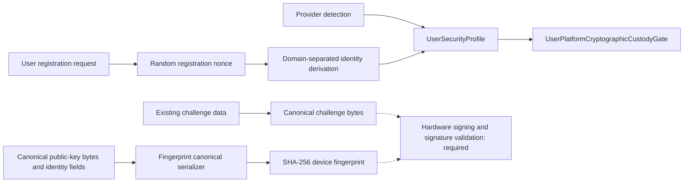

`SecurityIdentityDeriver` provides domain-separated identifiers for security instances, storage, keys, and checkpoints. `UserPlatformCryptographicCustodyGate` checks a supplied profile for a consistent hardware-ready, hardware-backed, non-exportable state. It does not authenticate the producer of the profile or obtain a fresh signature. That remains a significant user-runtime integration boundary.

The device-identity contracts distinguish stable account identity from individual device keys and fingerprints, allowing a multi-device account model. Fingerprint canonicalization uses strict UTF-8, already-normalized NFC text, bounded fields, and length-prefixed public-key material. SHA-256 produces the fingerprint.

The proof-of-possession challenge serializer writes domain/version/protocol/challenge/nonce/account/fingerprint/purpose strings with 32-bit big-endian lengths, followed by signed 64-bit big-endian millisecond timestamps. Seconds-to-milliseconds conversion is checked for overflow. Each string is limited to 16 KiB of encoded data; invalid Unicode, empty fields, and non-NFC inputs are rejected.

The V1 algorithm allowlist accepts exactly `ECDSA-P256-SHA256-P1363` with `EC-P256`, using ordinal, case-sensitive comparison. It selects an algorithm pair; it does not execute signature verification. The concrete production proof validator, hardware signer, enrollment authority, revocation service, and durable challenge ledger remain required.

## Account and encrypted-storage design

The ordinary-user account design is preserved in [specification templates](../security-infrastructure/specification-templates/security-spec). These are historical/versioned design documents, not migrations or operational configuration. Later refinements may select details that older parents still mark unselected; deployment must resolve those versions explicitly.

The account schema calls for a random immutable account ID, normalized unique email, password credentials, ordinary-user email verification challenges, password-reset challenges, sessions, and security events. The design uses Argon2id with unique salts and parameter versioning. Benchmark-dependent cost settings, several session/rate-limit controls, and the actual implementation remain unfinished.

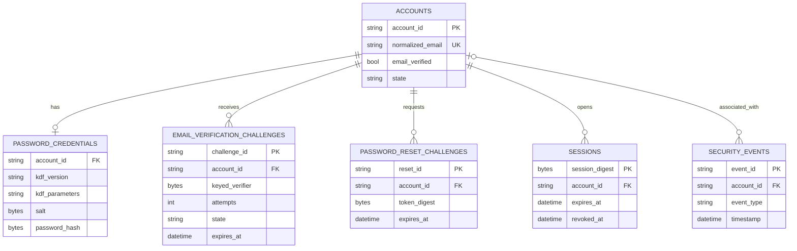

This is a conceptual subset of the specified fields; no database schema has been instantiated by the application. The schema prohibits plaintext password/code/session-token storage, requires atomic challenge consumption and attempt increments, and keeps verifier keys outside the database. Ordinary-user code verification is specified with HMAC-SHA256; reset/session tokens use stored digests. Authentication success does not grant production or provider-dispatch authority.

The later database-provider design selects SQLite/SQLCipher, official native SQLCipher distribution, and a .NET SQLite access family. It defines a common encrypted database format with platform-specific native integration. The current application project has no SQLCipher dependency or database engine implementation.

The key-wrap design separates a random 256-bit data-encryption key from hardware-protected wrapping keys:

| Platform family | Specified wrapping target | Status |
| --- | --- | --- |
| Windows/Linux | Hardware RSA-3072 with OAEP-SHA256 | Design; production provisioning and validation outstanding |
| macOS/iOS | P-256 ECIES with X9.63-SHA256 and AES-GCM | Design; actual runtime algorithm support must be established |
| Android | Hardware-backed RSA-OAEP-SHA256, StrongBox preferred | Design; fallback policy and native validation outstanding |

These are repository design choices, not fresh platform-compatibility certifications. Wrapped key metadata binds format, platform, algorithm, key identifier, and database identity. Migration requires authorized unwrap and rewrap; a common database format does not imply interchangeable wrapped-key ciphertext. Software/plaintext key fallback is prohibited by the design.

## Replay, rollback, and crash recovery

Replay contracts require independent uniqueness of request IDs and nonces; uniqueness of their pair alone is insufficient. Validation precedes consumption. Consumption must be atomic, persistent across restart and processes, and durable before dispatch. Unavailable/corrupt storage denies operations.

The rollback design evolves toward a counter-plus-commitment model: prepare authenticated next-checkpoint material, durably commit state, advance/read back the external counter, then finalize the anchor. A monotonic counter alone cannot authenticate which database contents belong to that counter value. The canonical replay-state commitment is distinct from SQLite page/WAL layout.

Storage identity contracts bind a logical storage identity to an authenticated manifest and an independently provisioned verification authority. Media paths and self-supplied public keys cannot bootstrap that authority. Counter attributes, authorization/session models, durable commitment implementation, and production provisioning remain unresolved.

The [checkpoint-ordering refinement](../security-infrastructure/specification-templates/security-spec/protected-operation-checkpoint-ordering-refinement-v1.conf.example) separates the pre-dispatch replay anchor from the post-outcome completion anchor:

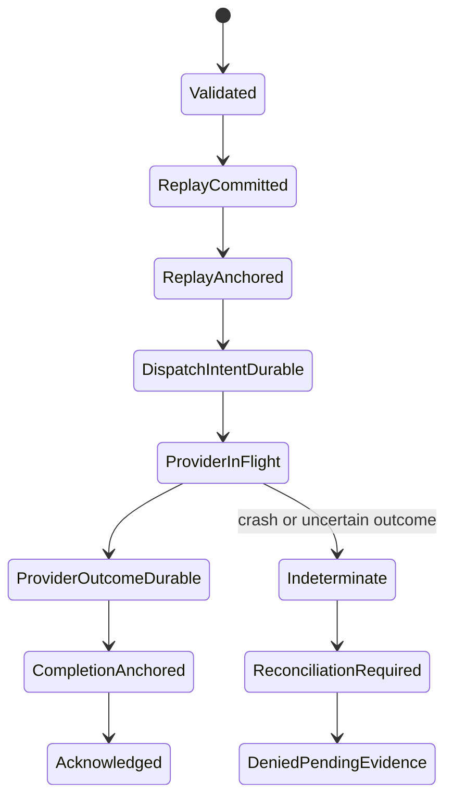

This is a **specified future operation sequence**, not an enabled production state machine. No provider call may precede replay anchoring and durable dispatch intent. No acknowledgement may precede durable outcome and completion anchoring. Ambiguous provider outcomes require reconciliation; automatic redispatch is prohibited. The design does not claim a single atomic transaction across database, TPM, and external provider or generic exactly-once side effects.

The [test seam](../security-infrastructure/src/Tests/I-Mortal.TrustBroker.Conformance/ProtectedOperationTestSeam.cs) currently maps fault-point enums to predetermined result counters. `Restart()` returns an in-memory field, and `Reconcile()` returns an empty result. These are concrete unfinished areas: they do not demonstrate disk persistence, actual crash recovery, or reconciliation.

## Protected-state contracts

Protected-state types describe snapshots, expected/current versions and digests, prepared transitions, commit requests/results, commit markers, recovery records, and confidential-boundary ownership. Atomic-store and transaction interfaces express compare-and-commit and state/replay coordination.

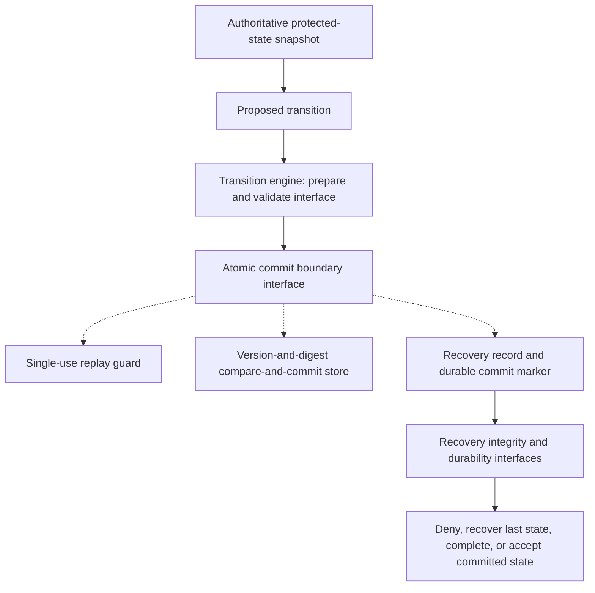

The phase vocabulary includes intent prepared/durable, state-and-replay prepared/durable, and commit-marker durable. Recovery dispositions default to denial and distinguish no transaction, last verified durable state, a completable durable transaction, and an already committed state.

The repository does not supply an operational atomic store, transition engine, replay guard, or recovery orchestrator. Helper classes that compare ownership references, AND asserted durability flags, or compare an unkeyed integrity hash do not independently prove authenticated ownership or durable media writes. Cryptographic contract envelopes, protector/verifier interfaces, and protected project-access/signing policies likewise require concrete trusted services.

### Cryptographic envelopes and signing policy

[CryptographicContractEnvelope](../security-infrastructure/src/Security/ConfidentialCompute/CryptographicContractEnvelope.cs)
stores envelope version, algorithm, key identifier, cryptographic domain, nonce,
ciphertext, authentication tag, and associated-data digest. It validates required
values and defensively copies binary fields on input and access. Creating a valid
envelope object does not authenticate its contents; protector and verifier
interfaces must establish that independently.

Protected identity records also have explicit canonical binary serialization,
version/history linkage, SHA-256 integrity calculation, and fixed-time integrity
comparison. Unkeyed record integrity detects inconsistency against an expected
value but cannot establish an authorized enrollment or current version by itself.
The encryption/key-operation contracts specify purpose-separated AES-256-GCM and
HMAC-SHA256 operations; their production providers are unfinished.

Project-signing policy requires an encrypted key, attestation and measurement
acceptance, a signed scoped capability, and project-access policy, alongside the
other independent authorization prerequisites. It prohibits plaintext key
persistence and export to the ordinary host or external applications. These are
policy declarations and interfaces; no operational project signer or protected
source-mutation integration is supplied.

## Security sensors and asset observations

[SecuritySensorCoordinator](../security-infrastructure/src/Security/Sensors/SecuritySensorCoordinator.cs) exposes separate platform-integrity and user-asset evaluations. Sensor output is reporting data; it cannot authorize a root operation, sign a transaction, or move assets.

| Plane | Monitored surfaces |
| --- | --- |
| Platform integrity | Source integrity, running workload, security policy, TEE measurement, attestation state, protected state, sensor self-integrity |
| User asset security | Account authentication, device possession, session integrity, trading activity, unauthorized transfer, withdrawal destination |

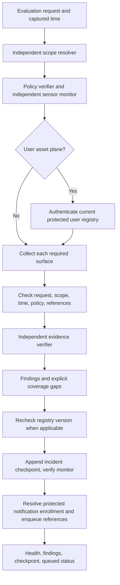

The coordinator rejects mismatched request/scope ownership, stale/future/expired observations, wrong policy versions, invalid finding codes, and malformed protected output references. TEE/attestation surfaces need a linked root evaluation. Missing collectors and verifiers become explicit gaps; coverage loss never becomes a clean scan.

Health outcomes are `NotEstablished`, `Unavailable`, `Degraded`, and `Healthy`. Healthy requires every required surface verified and zero findings. A verified authorized source change still produces a finding, so it does not yield a zero-finding healthy result in this implementation.

Incident checkpoints bind evaluation, tenant/user, plane, policy, and a digest of findings. The ledger and independent monitor must authenticate and persist that chain. A digest alone does not provide a signature. Notification enrollment resolution uses protected references; queueing is separate from delivery. Delivery failures are reported and have an additional ledger-status interface. Concrete durable ledger, independent monitoring, and delivery services are absent.

### Asset movement correlation

[ProtectedUserRegistry](../security-infrastructure/src/Security/Sensors/ProtectedUserRegistry.cs) models enrolled accounts, verified destinations, network/address/control scope, and registry version. Observations carry provider/account/event identity, sequence, reconciliation status, movement kind, operation, asset, amount, destination, network, and optional blockchain transaction identity.

`TransferCorrelation` first requires independent provenance verification and a reconciled withdrawal/internal-transfer observation. It then compares an authorization record bound to the same tenant, user, account, and operation:

| Evidence | Assessment |
| --- | --- |
| Missing verifier, missing authorization, wrong scope, unreconciled or unsuitable event | Insufficient evidence |
| Authenticated matching-scope record explicitly denies the operation | Confirmed violation |
| Valid authorization exactly matches asset, amount, destination, network, and expiry | Matched authorization |
| Remaining mismatches after provenance/scope checks | Suspicious |

Absence of a local authorization record does not establish illicit activity at an external provider. The code does not send orders, cancel trades, block withdrawals, or query an exchange itself. Telemetry interfaces and adapters still need authenticated provider integrations.

## Protected records and diagnostics

[ProtectedRecordAccess](../security-infrastructure/src/Security/Provisioning/ProtectedRecordAccess.cs) resolves protected handles without exposing a plaintext record payload. A random locator is a reference, not a bearer authorization capability.

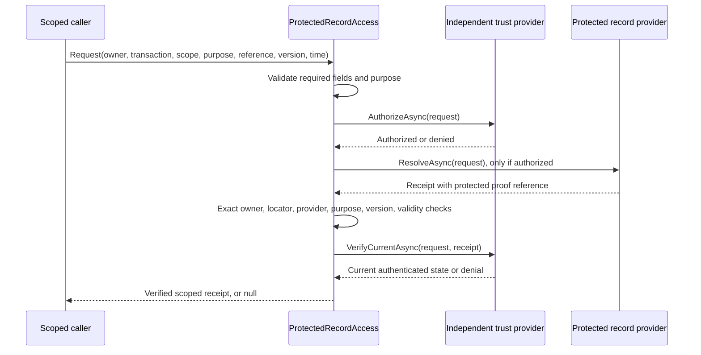

Missing providers or failed checks yield no receipt. Cancellation propagates; other exceptions return denial without reflecting provider payloads. The trust contract requires independent anchors and authoritative current version/revocation/rollback checks.

`IProtectedKeyOperations` and `IProtectedExternalServiceOperations` require reauthorization at use. Signing, decrypting into a caller-owned mutable buffer, and policy-constrained external read-only operations are interfaces, not supplied implementations. Decryption callers must clear their buffers; managed-string erasure is not claimed.

[SafeSecurityDiagnostic](../security-infrastructure/src/Security/Provisioning/SafeSecurityDiagnostic.cs) emits only an allowlisted code and correlation ID. Protected reference output is restricted to a nonempty GUID format. Formatting restricts accidental disclosure but does not authenticate the referenced object.

## Build, tests, and publication

The application targets .NET 10 with nullable analysis, implicit usings, invariant globalization, and self-contained/single-file/trimmed publishing settings. Runtime compilation excludes the `Tests` subtree. The original conformance project uses MSTest 4.0.2 and explicitly excludes its earlier enrollment test file from compilation.

Public checks build with self-contained publishing, trimming, and single-file output disabled for the portable harness run. That validates compilation and selected behavior; it does not validate a trimmed production deployment.


The exporter rejects unreviewed source-inventory changes. Its manifest records input/output paths and redaction counts. Exact regeneration compares bytes without publishing private digests. Public content checks enforce an allowlist, reject symlinks and common sensitive-value patterns, and compare the six utility copies with their exported counterparts. These checks are heuristics and require human review of new content.

Run from the repository root:

```sh
python3 tools/check.py
```

For maintainers with the source workspace:

```sh
python3 tools/export_security.py --source /path/to/private/TrustBroker --check
```

### Verification for this review

| Check | Result on 2026-10-01 | What it establishes |
| --- | --- | --- |
| Exact sanitized regeneration | PASS; 318 generated files | Published source/templates match the current reviewed exporter inputs |
| Exporter regression tests | PASS; 5 tests | Covered redaction/export edge cases |
| Public export behavior | PASS; 31 checks | Selected invalid-anchor and disabled-operation behavior |
| Algorithm allowlist | PASS; 17,972 input pairs across four cultures | Exact algorithm-pair handling in the tested cases |
| Canonical challenge serialization | PASS; 9 independent vectors and 11 rejection cases | Byte layout, Unicode boundaries, size checks, timestamp overflow handling |
| Public build and release checks | PASS | Portable harness/application compilation and publication rules |

The original conformance suite covers request validation, provider contracts/detection, mobile mappings, enrollment policy, runtime/startup denial, replay semantics, structural reachability, and protected-operation fault/restart scenarios. It also contains deployment-specific expectations, private-policy placeholders, Windows assumptions, and unfinished/red tests. It was inspected, not represented as fully passing.

Local experiments include serializer, validator-boundary and composition-model harnesses, transaction-binding exercises, static source inventories, and read-only TPM capability/NV/orderly-state probes. Prior inspection reports record baseline mismatches that stopped some historical runners before behavioral tests. Their expectations were not regenerated to conceal those mismatches. Historical results are not current end-to-end validation.

No hardware probes, production key operations, live authentication, external notifications, database provisioning, or trading operations were run for this documentation review. Private evidence, local binary artifacts, machine observations, and protected configuration values were not copied into the brief. The two access-restricted root deployment policies could not be inspected directly; their required semantics are visible in source.

## Remaining work and review findings

| Priority area | Concrete dependency or finding | Completion evidence needed |
| --- | --- | --- |
| Production composition | Entry point remains disconnected from root/sensors/record services | Reviewed host composition and protected operational policy |
| TEE trust | No approving cryptographic verifier/evidence service | Real signed evidence, pinned trust, current collateral/TCB/revocation and challenge binding |
| Authorization lifecycle | Only default denial is supplied | Durable issuance, concurrency/single-use tests, expiry and crash ambiguity handling |
| Workload provenance | Hash comparisons need trusted inputs | Authenticated manifest/policy acquisition and request-owned context production |
| User runtime | Profile predicate does not prove live possession | Authenticated enrollment, fresh hardware signatures, concrete verifier and revocation |
| Platform support | Detection is incomplete on several targets | Native implementation and independent validation on each supported platform |
| Account/database | Specifications are ahead of implementation | Resolved contract versions, benchmarked KDF, database integration and key lifecycle |
| Replay/rollback | No production persistence or counter authority | Authenticated storage identity, durable commitments, fault/restart validation |
| Recovery tests | In-memory restart and empty reconciliation implementation | Realistic persistent fake infrastructure before any production implementation |
| Sensors | Reporting composition exists without acquisition/ledger services | Authenticated feeds, loss/reconciliation tests, independent monitor and durable outbox |
| Protected records | Receipt checks exist without provisioned providers | Independent trust bootstrap and atomic current-state revalidation at use |
| Release lineage | Historical probe baselines have unresolved differences | Documented source transitions and deliberately reviewed new baselines |
| Trading application | No order/exchange/product workflow | Separate product implementation with security integration and operational tests |

Additional code-review limits remain relevant. The legacy time-based TEE overload reads some evidence properties outside its local verifier catches; its callers need their own exception boundary. Raw TDX/SNP DTOs contain mutable arrays and must remain untrusted acquisition data. The project-integrity transcript uses default UTF-8 encoding rather than the strict Unicode policy of the user-device serializer; malformed-Unicode behavior deserves dedicated tests before interoperability or canonical uniqueness claims. None of these observations is a claim of an exercised production exploit.

No production-readiness percentage is assigned. The source clearly establishes implemented checks and many explicit security boundaries, while the approving hardware, storage, provenance, and service implementations remain substantial work. No license grant has been selected; repository visibility alone is not an open-source license.
